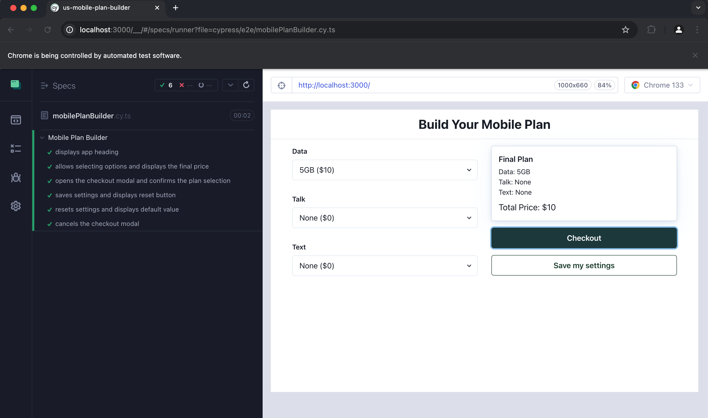

# US Mobile Plan Builder

A **React & TypeScript** application that allows users to build their own mobile plan by selecting data, talk, and text options. The application uses **React Query** to fetch pricing details from a mock JSON, **Zustand** for state management (including local storage persistence), and **Chakra UI** for styling and layout. Users can view their selected plan in real time, save/reset their selections, and confirm the plan via a checkout modal.

## Table of Contents

- [Features](#features)
- [Implementation Details](#implementation-details)
- [Installation](#installation)
- [Usage](#usage)
- [Running Tests](#running-tests)
    - [Unit Tests](#unit-tests)
    - [End-to-End Tests (Cypress)](#end-to-end-tests-cypress)
- [Folder Structure](#folder-structure)
- [Screenshots](#screenshots)
    - [1. Overall App View](#1-overall-app-view)
    - [2. Cypress Tests Running](#2-cypress-tests-running)
    - [3. Accessibility Report](#3-accessibility-report)
- [Assumptions and Trade-offs](#assumptions-and-trade-offs)

---

## Features

- **Build Your Own Plan:**  
  Users can choose from multiple options for data (5GB, 10GB, 15GB, Unlimited), talk (None, 100 mins, Unlimited), and text (None, 500 texts, Unlimited).

- **Real-Time Price Calculation:**  
  The application fetches pricing details from `/mock/pricing.json` using **React Query** and calculates the total price instantly as the user updates their selections.

- **Local Storage Persistence:**  
  Selections can be saved to and loaded from local storage using a **Zustand** store. This ensures that users can preserve their plan between sessions.

- **Checkout Modal:**  
  A confirmation modal summarizes the user’s final plan, allowing them to confirm or cancel.

- **Responsive & Accessible:**  
  Utilizes **Chakra UI** components and responsive props for mobile, tablet, and desktop. Includes basic accessibility best practices (e.g., semantic HTML, skip link, form labels).

- **Code Quality & Reusability:**
  - The project is enforced with **ESLint** and **Prettier** to maintain consistent code style and quality.
  - Components are designed to be highly reusable and modular, enabling easy maintenance and scalability.

- **Testing:**
  - **Unit tests** with Jest.
  - **End-to-end tests** with Cypress.


---

## Implementation Details

- **React Query** handles data fetching, caching, and error states for pricing information.
- **Zustand** manages the global state of selected plan options and provides methods for saving/resetting data in local storage.
- **Chakra UI** is used for a consistent design system, theming, and responsive layout.
- **Accessibility**:
    - Uses semantic tags (`header`, `main`) and form labels (`FormControl`, `FormLabel`) for better screen reader support.
    - Data attributes (`data-testid`) are added for testing and more robust element selection in Cypress.
- **Folder Structure** is organized to separate concerns (components, hooks, store, etc.), promoting maintainability and scalability.

---

## Installation

 **Install Dependencies**:
   ```bash
   npm install
   ```


## Usage
Start the Development Server:
   ```bash
    npm start
   ```

This runs the app in development mode. Open http://localhost:3000 in your browser to view it.

## Running Tests
## Unit Tests
This project uses Jest for unit testing.
   ```bash
    npm test
   ```
You can run tests in interactive watch mode or a single run.

## End-to-End Tests (Cypress)
We use Cypress for e2e testing:
   ```bash
    npm run e2e
   ```
This command opens the Cypress Test Runner. From there, you can select and run the e2e tests defined in cypress/e2e/.

## Folder Structure

```plaintext
us-mobile-plan-builder/
├── cypress/
│   └── e2e/
│       └── mobilePlanBuilder.cy.ts   # Cypress end-to-end tests
├── node_modules/
├── public/
│   ├── mock/
│   │   └── pricing.json              # Mock API data
│   └── index.html
├── src/
│   ├── components/
│   │   ├── FinalPlanCard.tsx
│   │   ├── FullScreenMessage.tsx
│   │   └── OptionSelect.tsx
│   ├── hooks/
│   │   └── usePricing.ts
│   ├── store/
│   │   └── usePlanStore.ts
│   ├── App.tsx
│   ├── constants.ts
│   ├── index.tsx
│   └── setupTests.ts                 
├── .eslintrc.json
├── .prettierrc
├── cypress.config.ts
├── package.json
├── README.md                         # Project documentation
├── tsconfig.json
└── package-lock.json
```

## Screenshots

### 1. Overall App View


_This screenshot shows the main page of the application._

---

### 2. Cypress Tests Running



_This screenshot shows Cypress end-to-end tests running successfully._

### 3. Accessibility Report


_This screenshot shows the Accessibility audit results with no errors._

---

## Assumptions and Trade-offs
**Local Storage:**
User selections are persisted in local storage so that they can be restored between sessions. This approach is sufficient for small-scale demos but might require a more robust solution in a production environment.

**Mock API:**
Pricing data is loaded from a static JSON file (/mock/pricing.json). For a real application, this would be replaced with a backend API endpoint.

**Accessibility & Responsiveness:**
Basic accessibility (skip link, form labels) and responsive design (stack vs. row) are implemented. Additional audits and refinements might be needed for production readiness.

**Testing Scope:**
Unit tests focus on the **usePlanStore** hook. Cypress tests cover main user flows (selecting options, confirming plan, saving and resetting). Further tests (performance, security) could be added in a larger-scale project.

**Over-Engineering vs. Demonstration:**
React Query, Zustand, and Chakra UI might be considered overkill for a very small project, but they demonstrate modern best practices and an ability to scale.

